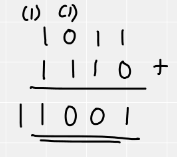
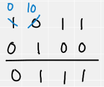

 # Decimal (Dernary)

- **Base 10**
- **Digits**: 0 to 9
- 
<sub>(base)</sub>10<sup> 2 (exponent)</sup> 

- How is 9456 made up?
	- (9*1000) + (4*100) + (5*10) + (6*1)
	 
	| 10^3 | 10^2 | 10^1 | 10^0 |
	| - | - | - | - |
	| 1000 | 100 | 10 | 1 |
	| 9 | 4 | 5 | 6 |

# Binary

- **Base 2**
- **Digits**:  0      	and 	1

- All data stored in a computer is binary. Shortened to bits (binary digits)
<br>
- Part 1
	- 1 bit = 0 or 1
	- 1 nibble 	= 4 bits
	- 1 byte = 8 bits / 2 nibbles
- Part 2
	- 1 kilobyte = 1000 bytes
	- 1 megabyte = 1000 kilobytes
	- 1 gigabyte = 1000 megabytes
	- 1 terabyte = 1000 gigabyte
- Part 3
	- 1 kibibyte  = 1024 bytes
	- 1 mebibyte = 1024 kibibytes
	- 1 gigibyte = 1024 mebibytes
	- 1 tebibyte = 1024 gigibytes

## Binary Addition

 - *( in this example, one bit is in excess for a nibble, It’s an example for a overflow error )*



```
	 1  0  1  1
	 1  1  1  0   (+)
———————————————
  1  1  0  0  1
———————————————
```
## Binary Subtraction

- Basics:
	- **1 - 0  =  1**
	- **10 - 1  =  1**
	- **11 - 1  =  10**

- Note:
	- **You can’t: 0 - 1, so, you have to borrow**



```
1  0  1  1
0  1  0  0   (-)
————————————
0  1  1  1
————————————
```

# Hexadecimal

- **Base 16**
- **Digits**:

	- 1 hex digit = 4 bits
	
	| Dernary | Hexadecimal | Binary  | 
	| ------- | ----------- | ------- |
	| 0       | 0           | 0000    |
	| 1       | 1           | 0001    |
	| 2       | 2           | 0010    |
	| 3       | 3           | 0011    |
	| 4       | 4           | 0100    |
	| 5       | 5           | 0101    |
	| 6       | 6           | 0110    |
	| 7       | 7           | 0111    |
	| 8       | 8           | 1000    |
	| 9       | 9           | 1001    |
	| 10      | A           | 1010    |
	| 11      | B           | 1011    |
	| 12      | C           | 1100    |
	| 13      | D           | 1101    |
	| 14      | E           | 1110    |
	| 15      | F           | 1111    |


- Bit patterns are multiples of 4


