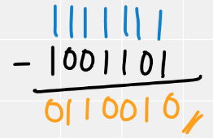
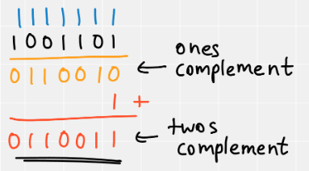
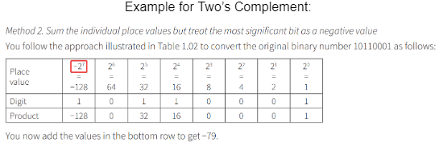
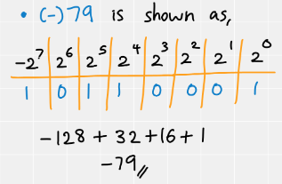
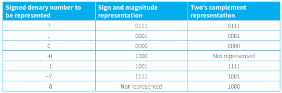
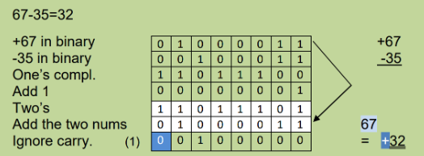
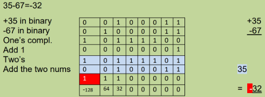

# Structure of a Byte

- In a byte, there are 8 bits:

					0 0 0 0   0 0 0 0
		    (most significant bit)		 (least significant bit)

# To store integers:

1. ## Unsigned integers
	- Only for positive (+) numbers
	- Uses all the bits to store the value

2. ## Signed integers
	- Store negative (-) numbers
	- One bit at left (MSB side) represents the sign, (if negative, its “1”)
	- Also called Sign and Magnitude Representation
	- Stored as either
		1. ### Ones Complement
			-  Number obtained by Subtracting 1 from each bit
			-  Basically inver every bit

			
			
		2. ### Two's Complement
			- Has only one representation of zero
			- Number obtained by:
				1. Get One's Complement
				2. Add “1”
			- **OR**
				- Start from LSB up to the first “1” (inclusive)  and invert every bit from that place
				
				

	- 
	- 
	- 
	- 
	- 