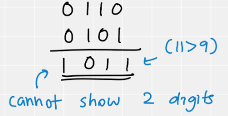
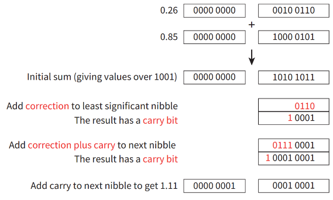

# Binary Coded Decimals

- **4 bits** represent one denary digit storing 16 values, but
	- we only need 0 to 9 characters (as we are displaying numbers)
	- therefore,
		- Only **0000-1001** are **valid**

- “85” can be represented as:
	- 0000**1000**  0000**0101** 		*(one BCD digit per byte)*
	- 1000**0101** 			*(two BCD digits per byte)*

- “8503” can be represented as:
	- 0000**1000** 0000**0101** 0000**0000** 0000**0011** 		*(one BCD digit per byte)*
	- 1000**0101**0000**0011** 					*(two BCD digits per byte)*

# Overflow Errors

- These can occur while basic binary arithmetic operations are done

- As a **fix**, add **“0110”**

