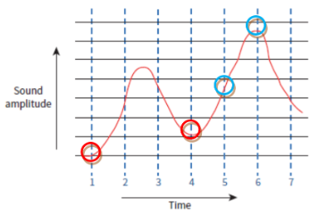
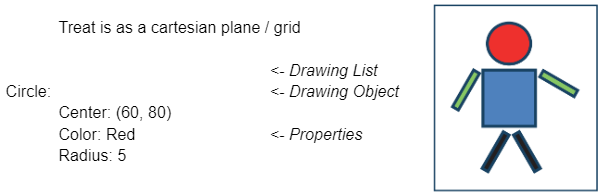

# Sound

- A Sound Encoder has two components:
	- **ADC (Analogue to Digital Converter):** converts analogue sound to digital form
	- **Band Limiting Filter:** removed high frequency parts that humans cannot hear
 
- **Analogue data:** data obtained by measurement of a physical property from sensors
- **Digital data:** stored as a binary value which can have one of a discrete range of values
- **Sampling:** taking measurements at regular intervals and storing the value
- **Sampling resolution:** number of bits used to store each sample  (store amplitude values). 16 bits is the minimum
- **Sampling rate:** number of samples taken per second
 

- Here, blue circled samples are not accurate as they are at the middle
- Blue vertical lines are for sampling time

# Images

## Vector Graphics

- Graphic made of drawing objects in a drawing list
- resiazble without lossing quality
 
- **Drawing Object:** component defined by geometric formulae and associated properties
- **Drawing List:** contains one set of values for each drawing object
- **Property:** defines one aspect of the appearance of the drawing object
 

Treat is as a cartesian plane / grid

- **->** Vector Graphic File
	- **->** Drawing List 
		- **->** Command for each object 
			- **->** Attributes 
				- **->** Define a property of the object 
					- **->** Basic Geometric Data

 

- **File Formats:** *.**svg**, *.**cdr**, *.**eps**

## Bitmaps

- No geometrically defined shape, 
- so it gets distorted and reduces quality as scaled (enlarged)
 
- **Pixel / Picture Element:** is the smallest identifiable component in a Bitmap image, made from a **two-dimensional array of Pixels.**

- Every pixel in this two dimensional matrix, has its,
	1. Positon
	2. Color

- **Color depth:** total number of colors that can be represented in an image.eg: 8-bit color can show 256 different colors | “number of bits per pixel”

- **Bit depth:** number of bits used to represent each pixel in the image, which allows for more subtle variations in color and shading. eg:, 8-bit bit depth would allow for 256 different shades of a single color. | “number of bits used to represent one pixel”

- **Resolution:**  product of the width and the height values in pixels
 

- **File Formats:** .**bmp**, .**png**, .**jpg**, .**jpeg**

### Calculating File Size

1. calculate a value for the minimum size of a bitmap file. The bitmap is to use a bit depth of 8 and the bitmap is to be printed with 72 dpi (dots per inch) and to have dimensions 5 inches by 3 inches

- bit depth is 8, which means 8 bits for each of the RGB components, so 24 (8*3) bits are needed for one pixel.
- 72 dpi means 72 pixels per inch
- number of pixels per row is 5 × 72 = 360 pixels
- number of pixels per column is 3 × 72 = 216 pixels
- total number of pixels is 360 × 216 = 77 760 pixels
- total number of bits is 77 760 × 24 = 1866240 bits 
- File size is  (1866240/8/1024) =  227.8 KiB

 

2. resolution is 1366 by 768 and color depth is 24

- number of bits we need is: 1366 * 768 * 24 = 25178112 bits
	- = 25178112 ÷ 8 = 3147264 bytes 
	- = 3147264 ÷ 1024 = 3073.5 kibibytes (3073.5 KiB) 
	- = 3073.5 ÷ 1024 = approximately 3 MiB
