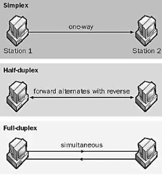
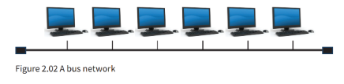
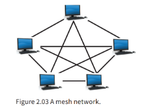
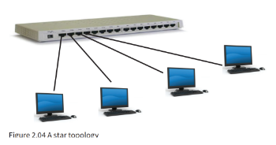

# Communications in a Network

Data can be **sent through a medium** as:

- A message can be sent as:
	1. ### Broadcast
		- one-to-all communication (as used traditionally for radio and television)
		
	2. ### Multicast
		- from one source to many destinations
		
	3. ### Unicast 
 		- one-to-one communication

# Network Topologies

**What is a topology?**

- Physical and logical arrangement of nodes and connections in a network
 
 1. ## Point to Point
 
	- Only unicast happens here
	- Isolated network with a dedicated link

 2. ## Bus Toplogy
 
	- has only one link but it is shared by many end-systems. so, its multipoint connection
	- Message is sent as broadcast
	- If one computer failed, other still function

 
 3. ## Mesh Toplogy
 
	- Unrealistic as amount of cabling required
	- Used for connection of routers within the infrastructure of the internet

 4. ## Star Toplogy

	- Each end system is linked to a central device
	- A hub or a switch (mostly with a router)
	- Most Common
	- Duplex transmission
	- Uses all broadcast, multicast or unicast

