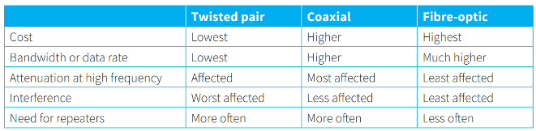
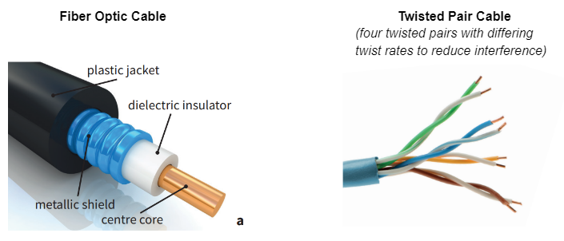
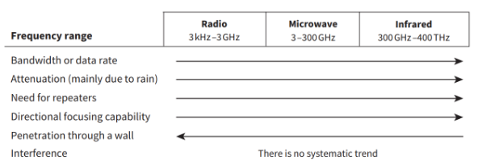
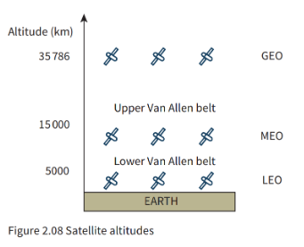

# Cables

Interference affects transmitted signals and the extent of attenuation (deterioration of the signal) when high frequencies are transmitted 

- **Bandwidth:** a measure of the amount of data that can be transmitted per second 

# Wireless Transmission

- Transmission using electromagnetic waves such as radio waves, microwaves or infrared
- The only difference among them are the frequencies and the wave lengths

- Wifi uses Radio Waves
- Van Allen belts are no go areas full of  Charged particles
- Geostationary Earth Orbit - telephone and  Computer network communication (Only 3 needed to cover the earth + slow)
- Medium Earth Orbit - provide GPS (Global Positioning System)
- Low Earth Orbit - mobile phone networks (need 50 for global coverage + fast)

