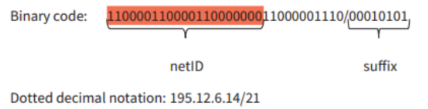

# IPv4 Addressing

- Based on 32 bits, it has only 232  addresses (4 billion devices approx.)

```
10000000 00001100 00000010 00011110
  128   .   12   .   2  .     30
		    128.12.2.30
```


- **Classless inter-domain routing (CIDR):** add an 8-bit suffix to the address that specifies the number of bits for the netID



## Subnetting

- divide a single network logically into multiple smaller networks, known as  sub networks or subnets. It partitions a large network into smaller, efficient subnets, which can improve network performance, security, and organization


## Network Address Translation (NAT)

- maps multiple private addresses inside a local network to a one public IP address before transferring the information onto the internet


# IPv6 Addressing

- Uses 128 bits, has 2128 addresses written as colon hexadecimal notation
- Code is broken into 16 bit parts
- Each part is represented by 4 hex characters (16/4)


# Domain  Names

- translating domain names into a specific IP address so that the initiating client can load the requested Internet resources, its done by Domain Name Servers
- Basically, Maps domain name into an ip address

<br>

- Advanced description (Not in Syllabus):
	- When the client types the web address, for example, google.com.
First, the web browser will try to find the ip address of the google.com domain in the local system cache. ( You view this cache in windows using ipconfig /displaydns  and in linux, you can use sudo journalctl -u system-resolved ). If it cannot be found in the local dns cache, the request will be sent to the resolver server (which is basically our ISP most of the time), Now, the resolver server will check its cache to find the ip for google.com. If it cannot be found, the query will be sent to the root server (this is at the top most level of the DNS hierarchy) (13 sets of these root servers are placed around the world ). The root server doesn't know what the IP address is for google.com. The root server will be the IP of the TLD server (the .com tld server in the case of google.com). The TLD will direct the resolver to the final level, the Authoritative Name Server which knows everything about the domain including the IP address. The IP for google.com will now be sent back to the resolver and then the PC, where both the resolver and the PC will cache that IP for a fast DNS resolve speed the next time the computer needs to resolve the IP for google.com. Software like PowerDNS are used in servers.
s