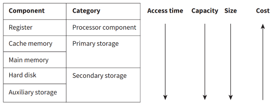

# Storage

# Embedded Systems

- Contains a processor, memory and I/O capabilities (all in one chip is a microcontroller)
- Special purpose, built only for a specific function
- Has small memory amounts, so, they are now used in IoT (Internet of Things)
- Accessibility causes security concerns

# Buffers

- Problem if data can be sent more quickly than it can be received (same for fetching data)
- To fix, use a buffer. Buffer is like a queue

