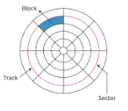

# Secondary Storage Devices

# Magnetic Media

- Built upon basic physics laws related to magnetism and electricity. The read head uses the opposite law to the write head. Used for long term data storage.
- First Hard Disk Drives, then Magnetic Tape drives

# Hard Disks

**Platters**: individual disks with each side having its own read-write head, stacked one above another spinning together at the same speed all at once

**The read-write head** never touches the disk platter surface (air gap)

**Tracks**: platter is divided into concentric tracks

**Sectors**: part of a track. Has 512 Bytes

**Cylinder**: platters stacked up on others

**Blocks**: OS deals with blocks, which is normally 1, 2, 4, 8, or more sectors

# Solid State Drive (SSD)

- No moving parts. Uses semiconductor - NAND flash made of NAND gates. 
- The **DRAM cache** keeps a map of where everything is for fast access. (high end optional)
- **Wear Leveling**: SSD moves data around the NAND flash chips to prevent wear by using several chips only.
- Without DRAM cache, random read and write operations are flowers (sometimes than HDD)
- Everything in NAND flash can be erased all at once

# Optical Media

- **CD** *(Compact Disk)* 
-  **CD-DA** *(Digital Audio)*
-  **CD-ROM** *(Read Only Memory)* 
-  **CD-RW** *(Read / Write)* 
-  **DVD** *(Digital Video Disk)*  
-  **DVD** *(Digital **Versatile** Disk)* 
-  **BD** *(Blue Ray Disk)*

- Infrared lasers of following wavelengths are used for CD and DVD read heads
	- CD: 780 nm
	- DVD: 680 nm
 
- In CD-RW / DVD-RW:
	- Reflective surface is a special alloy
	- When burning (writing to) the disk, heat generated by the absorption of the laser light changes the alloy to liquid form.
	- Depending on the intensity of the laser light the material turns either crystalline or amorphous solid form when it cools.
	- When reading, 
		- the laser light is reflected from crystalline solid,
		- not from the amorphous solid, 
		- allowing the coding of a 1 or 0.

## How is data read from an Optical Disk?

1. The optical disc has one spiral track running from the inner extreme of the surface to the outer edge. 
2. During operation, the disc spins. 
3. Simultaneously the laser moves across ensuring that it is continuously focused on the spiral track. 
4. The track on the surface of the disc has what are referred to as ‘pits’ and ‘lands’. 
5. The laser beam is reflected from the surface of the disc. 
6. The difference between the reflection from a pit compared to that from a land can be detected. 
7. This difference in the intensity of the light the detector receives can be interpreted as either a 1 or a 0 to allow a binary code to be read from the disc.

