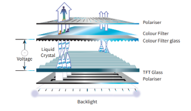

# Introduction

- Every pixel has 3 sub pixels for RGB, with varying levels of light provides full range of colors
- To dislplay (output) a CLI or GUI ( with WIMP - Windows Icons Menus Pointers)

# Flat screens 

- are mainstream now.

# LCD

- The LCD (Liquid Crystal Display) screen is **backlit** by an LED (Light Emitting Diode) light

- When voltage is given to an individual pixel cell the alignment of the liquid crystal molecules are affected. This changes the polarization of the light and so changes what is displayed on the screen. 

# Touch Screens

## History 

- CRT touch screens were there
- emitters on the sides of the screen with detectors positioned opposite to them.
- ( infrared light or ultrasonic wave emitters )
- When touched, the finger blocks some light or ultrasound where detectors measure  a reduced signal level

- Now, touch sensitive layer between the singer and screen

## Resistive Touch Screens

- a flexible surface that causes contact between electrically resistive layers beneath when touched
 
- two layers separated by thin space under the screen surface.  
- Screen is not rigid. 
- When pressed, the pressure moves the topmost of these two separated layers, making the top layer touch the lower layer. 
- The point of contact creates a voltage divider in the horizontal and vertical directions.

## Capacitive Touch Screens

- a rigid surface above a conductive layer that undergoes a change in electrical state when a finger  touches the screen
 

- When your finger touches a glass screen, it can cause a capacitance change. 
- **PCT (Projective Capacitive Touch)** with mutual capacitance is mainly used.
- Contains an array of capacitors.
- can detect the touch of several fingertips at the same time, allowing **multitouch**

# Virtual Reality Headset

- Two eyepieces fed with paired images which when looked together gives a 3D feel.
- Wearer controls by moving head or controlling device

