# Question 1

**a The following are the symbols for three different logic gates**

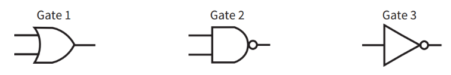

- **1. Identify each of the logic gates. [3]**

	- Gate 1 - OR Gate
	- Gate 2 - AND Gate
	- Gate 3 - NOT Gate

- **2. Sketch the truth table for either Gate 1 or Gate 2. [2]**

| A | B | A+B (OR gate) |
| - | - | - |
| 0 | 0 | 0 |
| 0 | 1 | 1 |
| 1 | 0 | 1 |
| 1 | 1 | 1 |

| A | B | A.B (AND gate) |
| - | - | - |
| 0 | 0 | 0 |
| 0 | 1 | 0 |
| 1 | 0 | 0 |
| 1 | 1 | 1 |

**b Consider the following circuit:**

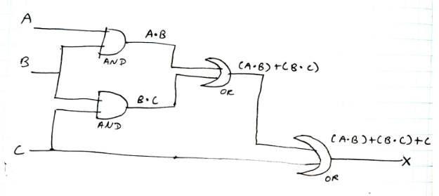

- **i  Complete the truth table for the circuit using the following template [2]**

| A | B | C | (A.B) | (B.C) | (A.B)+(B.C) | (A.B)+(B.C)+C
| - | - | - | - | - | - | - |
| 0 | 0 | 1 | 0 | 0 | 0 | 1 |
| 0 | 1 | 0 | 0 | 0 | 0 | 0 |
| 0 | 1 | 1 | 0 | 1 | 1 | 1 |
| 1 | 0 | 0 | 0 | 0 | 0 | 0 |
| 1 | 0 | 1 | 0 | 0 | 0 | 1 |
| 1 | 1 | 0 | 1 | 0 | 1 | 1 |
| 1 | 1 | 1 | 1 | 1 | 1 | 1 |
| 0 | 0 | 0 | 0 | 0 | 0 | 0 |

- **ii There is an element of redundancy in this diagram. Explain what the problem is. [2]**

	- HELP


# Question 2

**a. The definition of the NAND gate can be expressed as: `A NAND B is TRUE if A is FALSE or B is FALSE`. Sketch the truth table for a NAND gate. [2]**

| A | B | A.B | NOT(A.B) |
| - | - | - | - |
| 0 | 0 | 0 | 1 |
| 0 | 1 | 0 | 1 |
| 1 | 0 | 0 | 1 |
| 1 | 1 | 1 | 0 |

**b Consider the following statement:		(HELP)**
**In a competition, two teams play two matches against each other. One of the teams is declared the winner if one of the following results occurs:** 
**The team wins both matches.**
**The team wins one match and loses the other but has the highest total score.**

- Breaking down the problem:

```
Two teams: Team 1 vs team 2
Two matches: match 1 vs match 2

Only a single team wins if:
	Team X win match 1 and win match 2
	or
	Team X ( 
			( win match 1 and loose match 2 )
				Or
			( Loose match 1 and win match 2 )
		) 
		And
		Highest total score

```

- **i Identify the three logic propositions in this statement. [3]**

	- A: A team wins both of the matches
	- B: A team wins one match and loose the other but has the highest total score
	- C: One of the teams is declared the winner

- **ii By assigning the symbols A, B and C to these three propositions give the outcome of the competition as a logic expression. [3]**

	- C = A OR B	

- **iii Sketch a logic circuit to match this logic expression. [4]**

- HELP


# Question 3


**A domestic heating system has a hot water tank and a number of radiators. There is a computerized management system which receives signals. These signals indicate whether or not the conditions for components are as they should be. The following table summarizes the signals received:**

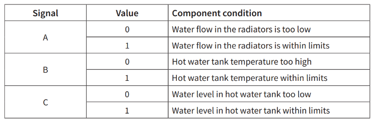


**a Consider the following fault condition. The water level in the hot water tank is too low and the temperature in the hot water tank is too high. The management system must output a signal to switch off the system.**

-  **i Sketch a truth table for this fault condition including the A, B and C signals. [4]**

	- The output is 1 for all combinations of A, B, and C except when A = 1, B = 1, and C = 1. 

	- In this given case scenario, 
		- when the water level is too low (C - 0) and 
		- the temperature is too high (B - 0),
	- the system should output 1 to switch off the system
	
| A | B | C | Output |
| - | - | - | - |
| 0 | 0 | 0 | 1 |
| 0 | 0 | 1 | 1 |
| 0 | 1 | 0 | 1 |
| 0 | 1 | 1 | 1 |
| 1 | 0 | 0 | 1 |
| 1 | 0 | 1 | 1 |
| 1 | 1 | 0 | 1 |
| 1 | 1 | 1 | 0 |

- **ii Sketch the circuit diagram for this fault condition to match this truth table. [5]**

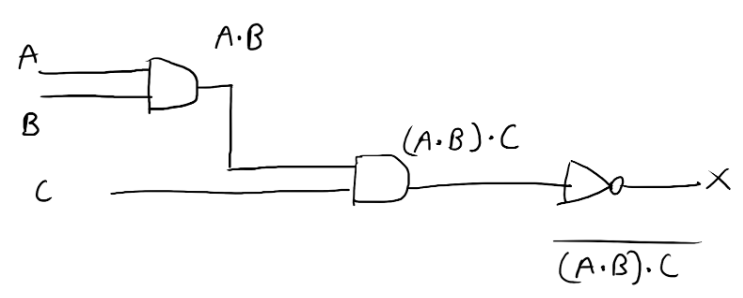

**b Consider the fault condition where the hot water tank temperature is within limits but the water flow in the radiators is too low and the water level in the hot water tank is too low. Sketch the circuit diagram for this fault condition which requires the management system to output a signal to increase water pressure. [5]**

- A = 0, B = 1, C = 0

| A | B | C | Output |
| - | - | - | - |
| 0 | 0 | 0 | 1 |
| 0 | 0 | 1 | 0 |
| 0 | 1 | 0 | 0 |
| 0 | 1 | 1 | 0 |
| 1 | 0 | 0 | 0 |
| 1 | 0 | 1 | 0 |
| 1 | 1 | 0 | 0 |
| 1 | 1 | 1 | 0 |

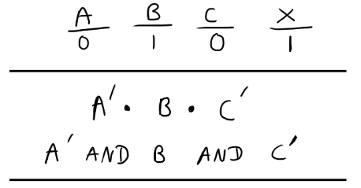

- HELP

# Question 4

**a Three digital sensors A, B and C are used to monitor a process. The outputs from the sensors are used as the inputs to a logic circuit. A signal, X, is output from the logic circuit:**

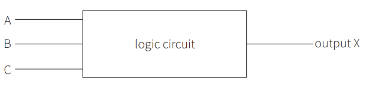

**Output, X, has a value of 1 if either of the following two conditions occur:**
**sensor A outputs the value 1 OR sensor B outputs the value 0**
**sensor B outputs the value 1 AND sensor C outputs the value 0**
**Draw a logic circuit to represent these conditions.**

- Breaking down the problem:

```
A, B, C inputs - X output is 1 if:
	A = 1 OR B = 0
		OR
	B = 1 AND C = 0
```

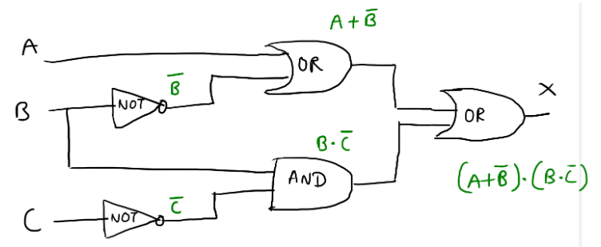

**b Complete the truth table for the logic circuit described in part (a) [4]**

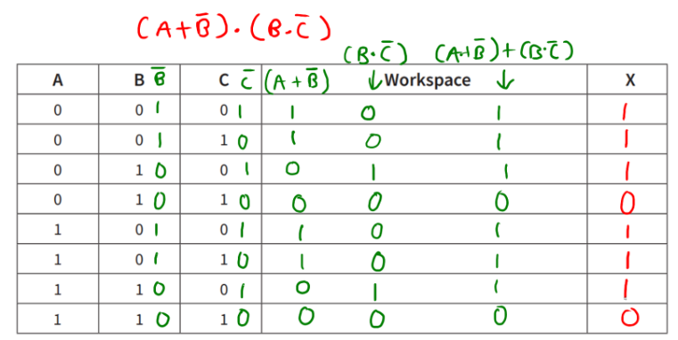

**C Write a logic statement that describes the following logic circuit. [3]**

- `(( (NOT A) and B )  OR ( C OR (NOT B) )) OR (NOT C)`

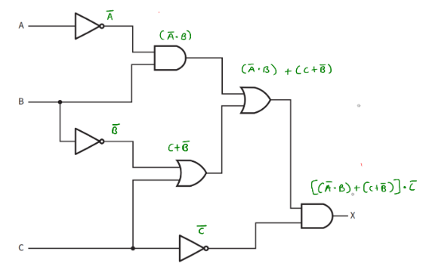

# Question 5

**a A student writes the following logic expression:**
 **X is 1 IF (B is NOT 1 AND S is NOT 1) OR (P is NOT 1 AND S is 1)**
**Draw a logic circuit to represent this logic expression.**
**Do not attempt to simplify the logic expression.**

- Breaking down the problem:

```
 X is 1 IF (B is NOT 1 AND S is NOT 1) OR (P is NOT 1 AND S is 1)
 X if ( (NOT B) and (NOT S) ) or ( (NOT P) and S )
```

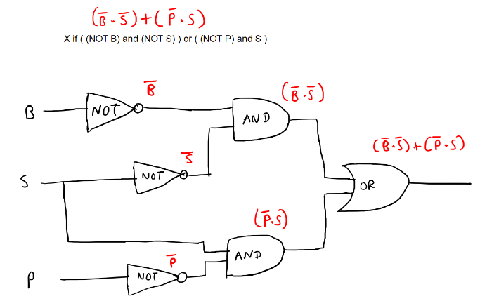

- **b Complete the truth table for the logic expression given in part (a).**

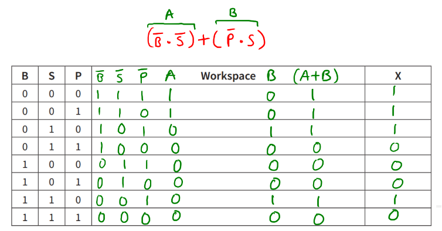

