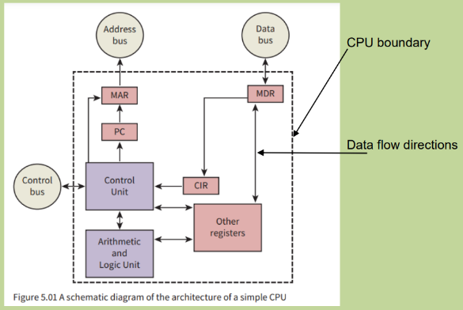
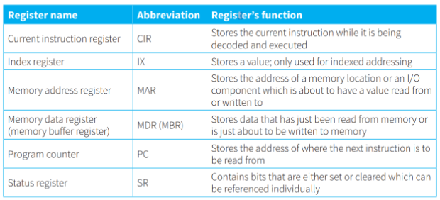

# Von Neumann Architecture

- There is a processor - the central processing unit (CPU) that has direct access to memory. 
- The memory contains a ‘stored program’ (not only data) (and can replace any time)
- The stored program consists of individual instructions.
- The processor executes instructions sequentially. 

# Central Processing Unit (CPU) Architecture

## Arithmetic Logical Unit:

- arithmetic & logic processing

## Control Unit:

- controls flow of data in CPU & whole computer system
- ensures program instructions are handled correctly
- has a clock to synchronize processes
	- **internal clock** controls cycles of activity in CPU
	- **system clock** controls activities outside CPU

- **clock speed** is the frequency of the internal clock cycle

## Registers:

- Storage components
- Very close to ALU, short access times
- sizes: 16, 32 or 64 bits
- Either general purpose or special purpose
- Stores a single value at a given time, to be used by ALU
- ALU can store different value in accumulator after execution

## Accumulator

- general purpose register storing value before and after execution by ALU
- 
## Additional Info

- MDR must act as a buffer because, Data transfer speed *inside* CPU **>** *outside* CPU 

- Special purpose register contains a single value Except Status Register (SR)
- Each bit is used as a **flag**. 1 = condition detected
	- e.g. carry flag, negative flag, overflow flag

