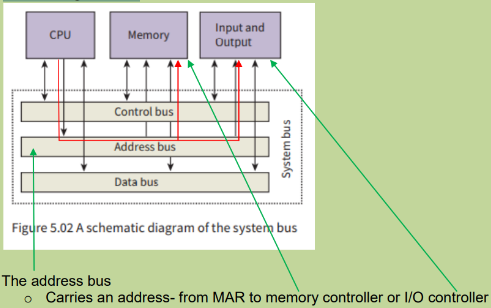

# The System Bus

- Parallel transmission component with each separate wire carrying a single bit.
- Not a storage device.

## Address Bus

- Carries an address- from MAR to memory controller or I/O controller

## Data Bus

- Carries data (instruction, address or value)

## Control Bus

- Transmits a signal from or to the Control Unit
- Mainly carries timing signals at time intervals dictated by the clock cycle

