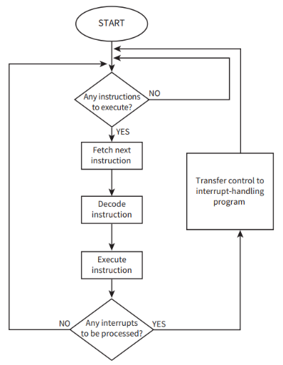

# TheFetch-Execute Cycle

### Learn more [here](https://www.youtube.com/watch?v=jFDMZpkUWCw)

- When a program is running, the program counter holds the address of the next instruction.
- In the fetch stage, the program counter address is transferred to the Memory Address Register (MAR).
- Simultaneously, the instruction at the MAR address is fetched into the Memory Data Register (MDR), and the program counter is incremented.
- The instruction in MDR is transferred to the Current Instruction Register (CIR).
- The clock cycle is controlled by the system clock, allowing one data transfer from memory per cycle.
- The program counter is incremented by 1 in the final step, but may need to be updated according to a jump instruction after the instruction has been decoded.
- In the decode stage, the control unit receives the instruction stored in the CIR as input.
- The control unit sends signals to appropriate components based on the instruction type to begin the execution stage.
- The Arithmetic Logic Unit (ALU) is activated if the instruction requires arithmetic or logic processing.
