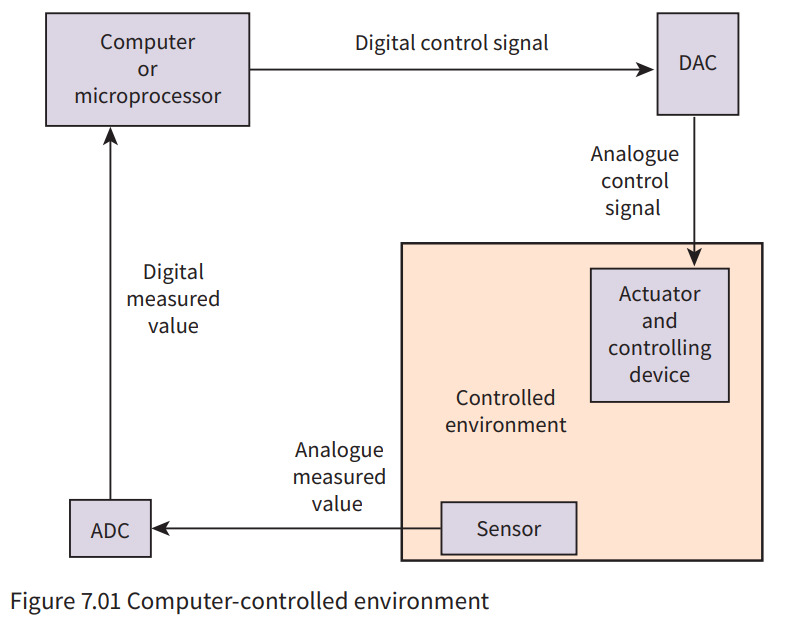
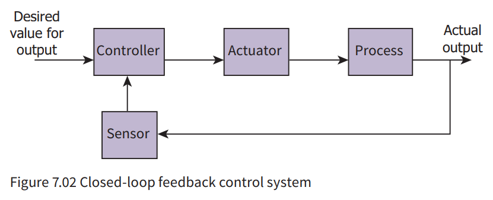

# Control Systems

- Monitoring system + ability to control a system

- Check condition by sensor
	- If condition is met: Continue
	- If condition is not met: Initiates control action by actuator

- Second check:
	- It checks the feedback for the first action

- A **feedback** is essential for a control system

 

- sensor -> ADC -> microprocessor -> DAC -> actuator

## Actuator 

- a hardware device that receives a signal from a computer and adjusts the setting of a controlling device

## Signal Conversion

- **ADC**: Analogue to Digital Converter
- **DAC**: Digital to Analogue Converter
- Most of the time, ADC and DAC is integrated into the sensor/actuator

## Closed loop feedback control system

- Feedback directly controls the operation
- Controller = microprocessor
- compares value for actual output, as read by the sensor, with the desired output

