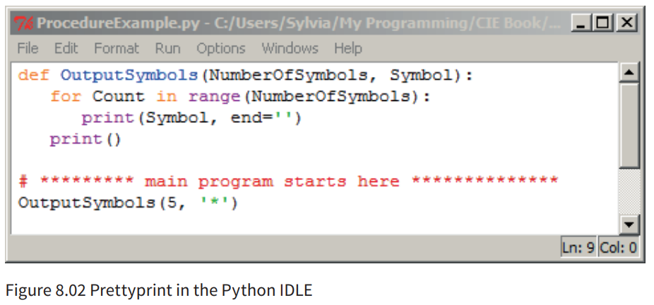
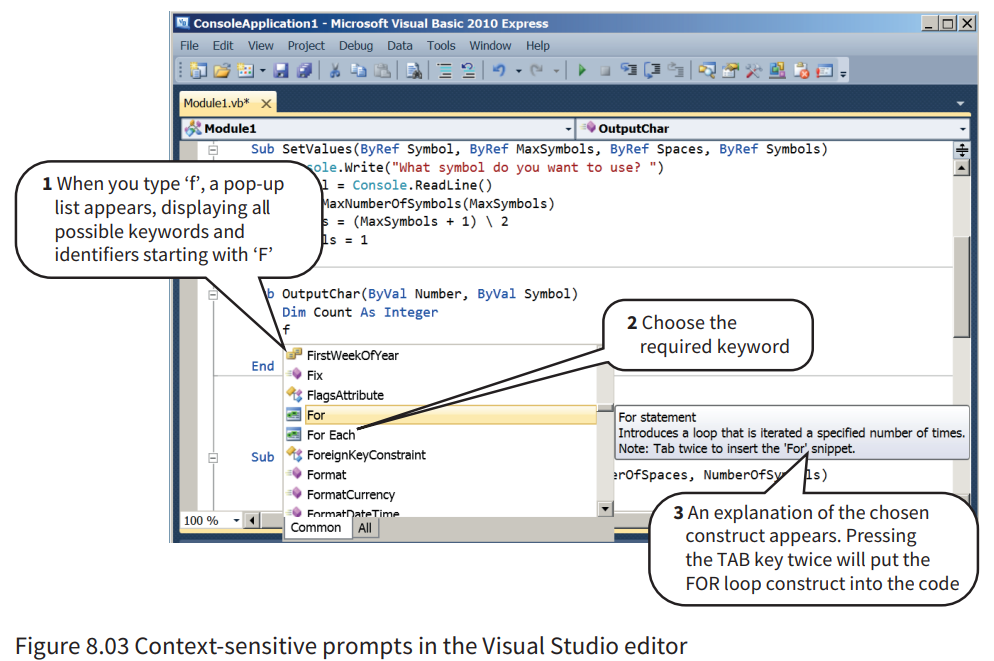
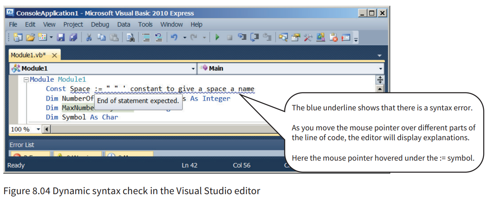
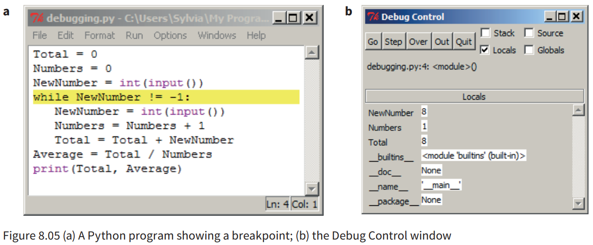

# Integrated Development Environment

## Pretty Printing

- **Syntax highlighting** - color code keywords, functions, variables, etc…

## Context Sensitive Prompts

- Display hints of what to come next, auto-completion

## Dynamic Syntax Checks

- Alert programmer of syntax errors while running

## Expanding and Collapsible Code Blocks

- Save excessive scrolling

## Debugging

- Help find and correct errors
- Add breakpoints and go through the program

