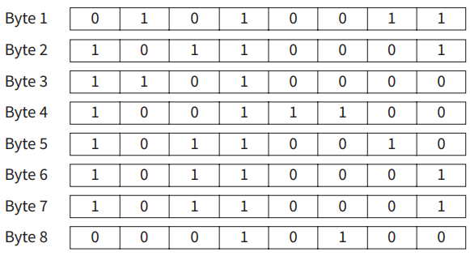

# Question 1

**1 a It is important that data has integrity**

-  **i Identify the missing word in the sentence ‘Concerns about the integrity of data are concerns about its [1]**
	-  accuracy

- **ii Validation and verification are techniques that help to ensure data integrity when data is entered into a system. Explain the difference between validation and verification. [3]**

	- Validation
		- Data might not me accurate but it's in the correct format and type
			- For example, in an online registration form, validation may involve checking if the email address entered has the correct format (e.g., containing an "@" symbol), if the required fields are filled out, or if a numeric field only contains numerical characters.

	- Verification
		- Confirm the data received by the system
		- Confirm that this is what the user intended to be entered
		- Double entry (re-typing the same thing again)
			- For instance, in a data entry scenario, verification may involve cross-referencing the entered data with an existing database or verifying it with a physical document or an authoritative source. This step helps to ensure that the data entered is consistent and reliable.

- **iii Define a type of validation and give an example. [2]**

	- By implementing range validation, you ensure that the entered age values are within the specified range, helping to maintain data integrity and accuracy within the defined limits.

- **iv Even after validation has been correctly applied data may lack integrity when it comes to be used. Explain why that might happen. [2]**

	- Manual Errors: Human mistakes during data entry or manipulation, such as typos or value swapping, can undermine data integrity even with validation measures in place.
	- External Factors: Factors like data transmission errors, hardware malfunctions, software bugs, or compatibility issues can corrupt or modify data, leading to integrity issues beyond the control of validation.
	- Changes over Time: Data integrity can be compromised as validated data becomes outdated or irrelevant due to environmental changes, evolving business rules, or unupdated validation rules, causing the data to lose its integrity in changed contexts.

**b Data should be protected from being read by unauthorised individuals. Explain two policies that can be used to provide the protection. [4]**

- Access Control Policy
	- define rules to regulate who can access specific data and what actions they can perform
	-  ensure that only authorized individuals or entities can read or modify the data
		-  Role-Based Access Control (RBAC)
			- predefined roles are assigned to users, like: accountant, manager, etc...
		-  Mandatory Access Control (MAC)
			- assign security labels or levels to both data and users which indicate sentivity of the data and the clearance levels of the users
			
- Encryption Policy
	- transforming data into a coded format that can only be deciphered with the correct encryption key
	- safeguards the confidentiality of the data
	- man in the middle cannot read it even if they gain access to the data as its encrypted
		- data encryption at rest
			- encrypting data when it is stored or saved
			- protects from data breaches or physical theft of storage devices
		- data encryption in transit
			- Protocols like SSL/TLS (Secure Sockets Layer/Transport Layer Security) can be used 
			- protects against a man in the middle or sniffing attacks

# Question 2

**2 a Security of data is an important concern for a system administrator.**

- **i Identify three reasons why data might not be available when a user needs it. [3]**

	- Hardware or Infrastructure Failures
	- Software or Application Issues
	- Security Measures and Access Control
		-  If stringent security policies, such as authentication, authorization, or encryption, are in place to protect sensitive data, users may encounter difficulties accessing the data if they lack the necessary permissions or credentials

- **ii Describe what could be features of a policy for ensuring data security. [3]**

	- Access Control:
		- The policy should define user roles, privileges, and permissions to control access to data, utilizing strong authentication methods and session management practices.
	- Data Classification and Handling:
		- The policy should specify procedures for classifying data based on sensitivity, providing guidelines for encryption, storage, transmission, and disposal to ensure proper handling and protection.
	- Incident Response and Reporting:
		- The policy should outline protocols for promptly identifying, analyzing, and containing data security incidents, including guidelines for reporting to relevant authorities and stakeholders.
	- Employee Training and Awareness:
		- The policy should mandate regular security awareness programs to educate employees about data security best practices, risks of data breaches, and their responsibilities in safeguarding data.
	- Regular Security Assessments and Audits:
		- The policy should include provisions for conducting periodic security assessments and audits to identify vulnerabilities, evaluate compliance, and address weaknesses in data security controls.

**b It is important for mission-critical systems that there is a disaster recovery contingency plan in place.**
	
- **i Define what type of disaster is under consideration here. [2]**
	-  disaster recovery contingency plan for mission-critical systems is typically a severe and disruptive event that can lead to the loss or unavailability of critical infrastructure, data, or services. Such disasters can include natural disasters like earthquakes, floods, hurricanes, or wildfires, as well as human-made disasters like cyber-attacks, power outages, hardware failures, or system malfunctions
	-  focus of the contingency plan is to ensure the rapid recovery and restoration of the affected systems and data to minimize downtime and maintain the continuity of operations

- **ii Define what will be a major feature of the contingency plan. [2]**

	- creating redundant copies of critical data, applications, and infrastructure components to ensure their availability in the event of a disaster.
	- outline procedures for regular backups, off-site storage, and data replication to minimize data loss and enable the swift restoration of services
	- ensure that the system can be recovered and operations can resume as quickly as possible after a disruptive event

**c Measures to ensure security of a computer system need to be in place on a daily basis if the system is connected to the Internet. Describe two measures that could be taken to ensure security of the system. [4]**

- Firewall Implementation:
	- By implementing a firewall, unauthorized access attempts and malicious network activities can be detected and blocked
	- Configuring the firewall to allow only necessary network traffic and blocking any unauthorized or suspicious connections.
	- Regularly updating the firewall software
	- Monitoring firewall logs and alerts
- Regular System Updates and Patch Management:
	- essential to address vulnerabilities and security flaws that could be exploited by attackers
	- Installing operating system updates, software updates, and security patches
	- Enabling automatic updates (atleast for security updates)
	- Regularly scanning the system for vulnerabilities and using vulnerability management tools

# Question 3

**3 a When data is transmitted measures need to be applied to check whether the data
has been transmitted correctly.**

- **i If data consists of seven-bit codes transmitted in bytes, describe how a simple parity check system would be used. Your account should include a description of what happens at the transmitting end and what happens at the receiving end. [5]**

	- At the Transmitting End:
		- Data Division: The data is divided into bytes, with each byte consisting of seven bits representing the actual data and an additional bit for parity.
		- Parity Calculation: For each byte, the parity bit is calculated based on the number of set (1) bits in the data bits. There are two types of parity checks: even parity and odd parity. In even parity, the parity bit is set to make the total number of set bits (including the parity bit) even, while in odd parity, it is set to make the total odd.
		- Parity Bit Appended: The calculated parity bit is added to the byte, forming an eight-bit code.
		- Transmission: The bytes, including the added parity bits, are transmitted over the communication channel.

	- At the Receiving End:
		- Reception: The transmitted bytes, including the parity bits, are received at the receiving end.
		- Parity Check: For each received byte, a parity check is performed. The receiving system calculates the parity bit based on the received data bits.
		- Error Detection: The calculated parity bit is compared with the received parity bit. If they match, it indicates that no error occurred during transmission. If they do not match, it implies that an error might have occurred during transmission.
		- Error Handling: In case of a parity mismatch, the receiving system can take appropriate actions, such as requesting retransmission of the data or triggering an error alert for further investigation.
		
	- The simple parity check system can detect the presence of errors in the transmitted data but cannot identify the specific bit(s) that caused the error. It provides a basic level of error detection, ensuring that the received data is likely to be error-free when the parity check is successful.

- **ii An alternative approach is to use a checksum method. Describe how this works. [3]**
	
	- The checksum method provides a more robust error detection capability compared to the simple parity check. By using a mathematical algorithm to calculate the checksum, it can detect a wider range of errors, including single-bit errors and some multiple-bit errors. However, like the parity check, the checksum method can detect errors but cannot identify the specific bit(s) that caused the error.
	
		- Data Division: Similar to the parity check method, the data is divided into fixed-size blocks, often in bytes or words.

		- Checksum Calculation: For each block of data, a checksum value is calculated based on the data content. The checksum calculation involves applying a mathematical algorithm, such as a sum, XOR, or CRC (Cyclic Redundancy Check), to the data bits.

		- Checksum Appended: The calculated checksum value is appended to the data block, creating an extended block that includes both the original data and the checksum.

		- Transmission: The extended blocks, containing the original data and the checksum, are transmitted over the communication channel.

		- Reception: At the receiving end, the transmitted extended blocks are received.

		- Checksum Recalculation: The receiving system performs the same checksum calculation on the received data, excluding the checksum value.

		- Checksum Verification: The recalculated checksum is compared with the received checksum. If they match, it indicates that the data is likely to be error-free. If they don't match, it suggests that an error might have occurred during transmission.

		- Error Handling: In case of a checksum mismatch, the receiving system can take appropriate actions, such as requesting retransmission of the data or triggering an error alert for further investigation.

**b For either of these two methods there are limitations as to what can be achieved by them. Identify two of these limitations. [2]**

- Limited Error Detection Capability
	- Both methods have limitations in their ability to detect certain types of errors.
	- Parity Check
		- can only detect an odd number of bit errors
		- If an even number of bit errors occurs within a byte or block, the parity check method will fail to detect the error
		- it cannot identify the specific bit(s) that caused the error, making it challenging to pinpoint and correct the exact error
	- Checksum
		- It may fail to detect some types of errors, like that result in a cancellation of bits or certain patterns of multiple-bit errors
		- It is also possible for different sets of data to produce the same checksum value, resulting in a false positive indication of data integrity.

- Inability to Correct Errors
	- Both the parity check and checksum methods are limited to error detection only
	- do not have the capability to correct errors in the transmitted data
	- these methods can indicate that an error has occurred, but they cannot automatically correct the error or recover the original data
	- error correction codes or retransmission protocols, need to be employed to handle error correction additionally

**c A different method which does not have all of these limitations is the parity block check method. The following diagram represents eight bytes received where the parity block method has been applied at the transmitting end. The first seven bytes contain the data and the last byte contains parity bits.**

**Identify the problem with this received data and what would be done with it by the program used by the receiver.**

# Question 4

**4 a Give the definition of the terms firewall and authentication. Explain how they can help with the security of data. [3]**

- Firewall
	- sits between the computer or LAN and the Internet/WAN and permits or blocks traffic to/from the network
	- can be software and/or hardware
	- software firewall can make precise decisions about what to allow or block as it can detect illegal attempts by specific software to connect to Internet
	- can help to block hacking or viruses reaching a computer

- Authentication
- process of determining whether somebody/something is who/what they claim to be
- frequently done through log on passwords/biometrics
- because passwords can be stolen/cracked, digital certification is used
- helps to prevent unauthorised access to data 

**b Describe two differences between data integrity and data security. [2]**

- (one mark for security, one mark for integrity)
- integrity deals with validity of data/freedom from errors/data is reasonable
- security deals with protection of data
- security protects data from illegal access/loss
- integrity deals with making sure data is not corrupted after, for example, being transmitted 

**c Data integrity is required at the input stage and also during transfer of the data.**

- **i State two ways of maintaining data integrity at the input stage. Use examples to help explain your answer [3]**

	- validation (to ensure data is reasonable)
	- examples include range checks, type checks, length checks, …
	- verification (checks if data input matches original/if transmitted data matches original)
	- can use double data entry or visual check/other methods such as parity checks
	- doesn’t check whether or not data is reasonable

- **ii State two ways of maintaining data integrity during data transmission. Use examples to help explain your answer. [3]**

	- parity checking
	- one of the bits is reserved as parity bit
	- e.g. 1 0 1 1 0 1 1 0 uses odd parity
	- number of 1s must be odd
	- parity is checked at receiver’s end
	- a change in parity indicates data corruption
	- check sum
	- adds up bytes in data being sent and sends check sum with the data
	- calculation is re-done at receiver’s end
	- if not the same sum then the data has been corrupted during transmission 

# Question 5

**5 Verification and validation can be applied during data entry. Describe what is meant by these terms. For each method, explain why it is needed. [4]**

- Verification (one mark for description, one mark for explanation of need)

  - needed to ensure that the data entered exactly matches the original source/data is consistent
  - comparison of two versions of the data
  - examples include double entry, visual checking, proof reading etc...
  - does not check data is sensible/acceptable

- Validation (one mark for description, one mark for explanation of need)

  - needed to check that the data entered is sensible/reasonable/acceptable/matches required criteria
  - automatic check by computer
  - examples include range, type, length, etc.
  - does not check data is correct

