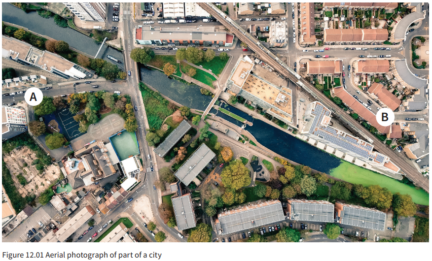

# Abstraction

- removing unwanted information from the problem to solve

- In the above image, all of the details of the buildings are uncessacary, if we just need information about the roads only

# Decomposition

- breaking problems to sub problems
- to explain the process clearly
- eg:
	- using subroutines / functions

# Data modelling

- analysing and organizing data using Abstract Data Types, custom data types, etc..

# Pattern recognition

- Look for patterns or common solutions
- reduces repeated code

# Algorithm design

- a sequence of defined steps that can be carried out to perform a task
