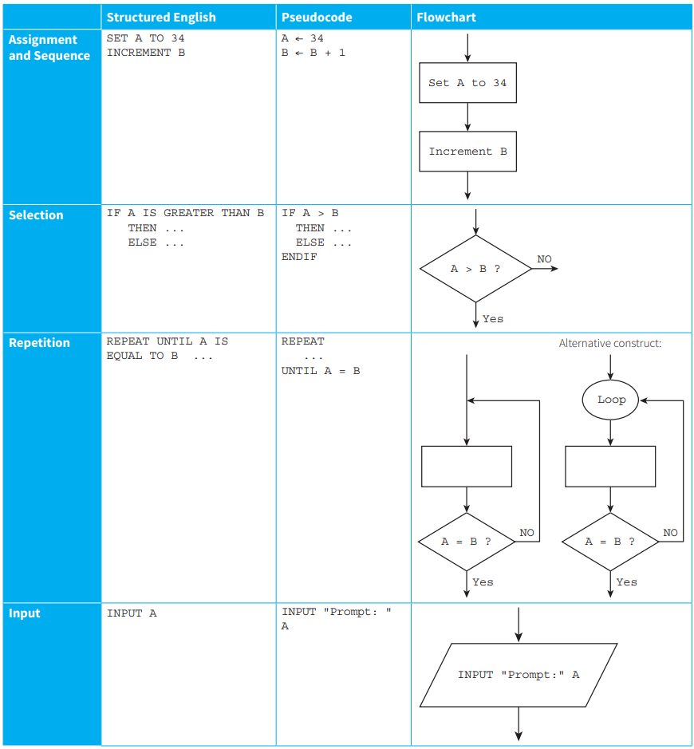
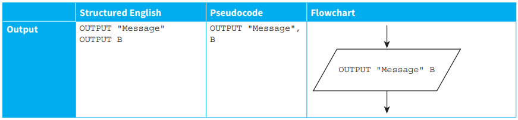

## What is an Algorithm?

- a sequence of defined steps that can be carried out to perform a task

# Expressing Algorithms

1. ### Structured Enlish

- subset of enligsh language that has commanding statements

2. ### Pseudocode

- using keywords and identifiers to describe an algorithm without following the syntax of particular programming language (like a universal solution)

3. ### Flowchart

- shaped linked together to represent the sequential steps of an algorithm

## Constructs Used

1. ### Assignment:

	- a value is set to a given identifier (variable)
	- or, the set value to changed (re-set) to the given identifier (variable) 

2. ### Sequence:

	- no. of steps performed, one after another, sequentially

3. ### Selection:

	- Conditionals
	- some statements occure when some condition is met

4. ### Repetition:

	- same sequence of steps repeating a number of times
	- aka: iteration, looping

## Syntax / Examples / Usage

