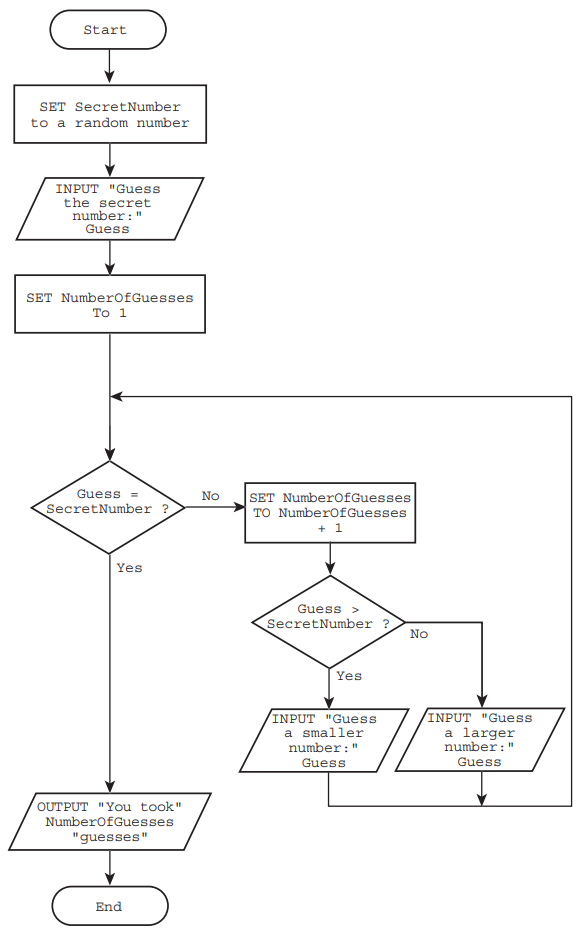

# `REPEAT`...`UNTIL`

- literally repeat until condition is met

#### Syntax

```
REPEAT
	<condition(s)>
UNTIL <condition>
```

#### Example

- pseudocode
```
INPUT BiggestSoFar
Counter ← 1
REPEAT
 	INPUT NextNumber
 	Counter ← Counter + 1
 	IF NextNumber > BiggestSoFar THEN
 		BiggestSoFar ← NextNumber
 	ENDIF
UNTIL Counter = 10
OUTPUT BiggestSoFar
```

- Identifier table

| Identifier     | Explanation                            |
|----------------|----------------------------------------|
| BiggestSoFar   | Stores the biggest number input so far  |
| NextNumber     | The next number to be input             |
| Counter        | Stores how many numbers have been input so far |

# `FOR`...`NEXT`


#### Syntax

```
FOR <Variable Name> <- <From> TO <To>
	<statement(s)>
NEXT <Variable Name>
```

- `NEXT <Variable Name>` is to increment the variable

#### Example

```
FOR Counter ← 2 TO 10
 	INPUT NextNumber
 	IF NextNumber > BiggestSoFar THEN
 		BiggestSoFar ← NextNumber
 	ENDIF
NEXT Counter
```

- Identifier Table

| Identifier     | Explanation                                  |
|----------------|----------------------------------------------|
| BiggestSoFar   | Stores the biggest number input so far        |
| NextNumber     | The next number to be input                   |
| Counter        | Counts the number of times round the loop     |

# Break out of loops

### What is a Rogue Value?

- a value used to terminate a sequence of values

#### Example

- pseudocode

```
INPUT NextNumber
BiggestSoFar ← NextNumber
WHILE NextNumber <> 0 DO // sequence terminator not encountered
 	INPUT NextNumber
 	IF NextNumber > BiggestSoFar THEN
 		BiggestSoFar ← NextNumber
 	ENDIF
ENDWHILE
OUTPUT BiggestSoFar
```

- python implementation

```python
NextNumber = int(input("NextNumber: "))
BiggestSoFar = NextNumber

while NextNumber != 0:
    NextNumber = int(input("NextNumber: "))
    if NextNumber > BiggestSoFar:
        BiggestSoFar = NextNumber

print("BiggestSoFar:", BiggestSoFar)
```

- Identifier Table

| Identifier     | Explanation                            |
|----------------|----------------------------------------|
| BiggestSoFar   | Stores the biggest number input so far  |
| NextNumber     | The next number to be input             |


# Nested Loops

- a loop inside another loop

#### Example

```
INPUT NumberOfRows
INPUT NumberOfColumns
INPUT Symbol

FOR RowCounter ← 1 TO NumberOfRows
 	FOR ColumnCounter ← 1 TO NumberOfColumns
 		OUTPUT Symbol // without moving to next line
 	NEXT ColumnCounter
 	OUTPUT Newline // move to the next line
NEXT RowCounter
```

- this will be the output for these input values:  *3, 7 and &*

```
&&&&&&&
&&&&&&&
&&&&&&&
```

- Identifier Table

| Identifier        | Explanation                                    |
|-------------------|------------------------------------------------|
| NumberOfRows      | Stores the number of rows of the grid           |
| NumberOfColumns   | Stores the number of columns of the grid        |
| Symbol            | Stores the chosen character symbol              |
| RowCounter        | Counts the number of rows                       |
| ColumnCounter     | Counts the number of columns                    |


# Examples

## Running Totols and Averages

#### Pseudocode

```
RunningTotal ← 0

FOR Counter ← 1 TO 10
 	INPUT NextNumber
 	RunningTotal ← RunningTotal + NextNumber
NEXT Counter

OUTPUT RunningTotal

Average ← RunningTotal / 10
OUTPUT Average
```

#### Python

```python
RunningTotal = 0

for Counter in range(1, 11):
    NextNumber = int(input("NextNumber: "))
    RunningTotal += NextNumber

print("RunningTotal:", RunningTotal)

Average = RunningTotal / 10
print("Average:", Average)

```

#### Identifier Table

| Identifier     | Explanation                                  |
|----------------|----------------------------------------------|
| RunningTotal   | Stores the sum of the numbers input so far    |
| Counter        | How many numbers have been input              |
| NextNumber     | The next number input                         |
| Average        | The average of the numbers input              |


## Random Number Guessing Game

#### Pseudocode

```
SecretNumber ← Random
INPUT Guess
NumberOfGuesses ← 1
WHILE Guess <> SecretNumber DO
    IF Guess > SecretNumber THEN
        // the player is given the message to input a smaller number
    ENDIF
    IF Guess < SecretNumber THEN
        // the player is given the message to input a larger number
    ENDIF
    INPUT Guess
    NumberOfGuesses ← NumberOfGuesses + 1
ENDWHILE
OUTPUT NumberOfGuesses
```

#### Python

```
import random

SecretNumber = random.randint(1, 100)  # Generate a random number between 1 and 100
Guess = int(input("Guess: "))
NumberOfGuesses = 1

while Guess != SecretNumber:
    if Guess > SecretNumber:
        print("Input a smaller number.")
    elif Guess < SecretNumber:
        print("Input a larger number.")

    Guess = int(input("Guess: "))
    NumberOfGuesses += 1

print("NumberOfGuesses:", NumberOfGuesses)
```

#### Flow Chart



#### Identifier Table

| Identifier       | Explanation                                |
|------------------|--------------------------------------------|
| SecretNumber     | The number to be guessed                    |
| NumberOfGuesses  | The number of guesses the player has made    |
| Guess            | The number the player has input as a guess  |
