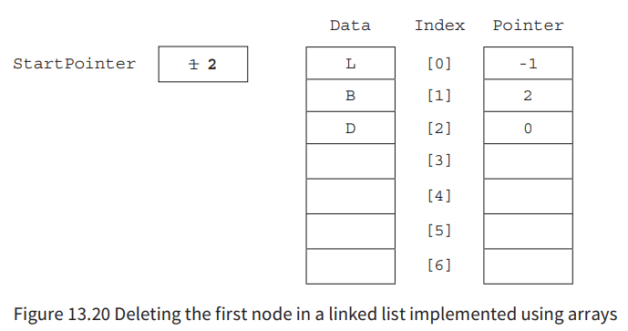

-  a collection of data with associated operations
### Available Operations

- create a new instance of the data structure
- find an element in the data structure
- insert a new element into the data structure
- delete an element from the data structure
- access all elements stored in the data structure in a systematic manner.

# Stacks

Represents a collection of elements with two principal operations: push and pop. referred to as a "last-in, first-out" (LIFO) data structure because the last element added to the stack is the first one to be removed.

A stack can be visualized as a stack of objects, where new objects are added to the  top, and removals also happen from the top. This behavior is analogous to a stack of plates or a stack of books, where you can only add or remove items from the top.

## [How does it work?]( https://www.youtube.com/watch?v=I37kGX-nZEI&pp=ygUQc3RhY2tzIGV4cGxhaW5lZA%3D%3D)

## Operations

1. Push
	- This operation adds an element to the top of the stack.

2. Pop
	- This operation removes the topmost element from the stack.

3. Peek/Top
	- This operation retrieves the value of the topmost element in the stack without removing it.

4. isEmpty
	- This operation checks if the stack is empty, i.e., it returns true if there are no elements in the stack and false otherwise.

# Queues

A queue is a linear data structure that follows the First-In-First-Out (FIFO) principle, which means that the first element added to the queue will be the first one to be removed. It can be visualized as a line of people waiting for their turn, where the person who arrives first gets served first.

In a queue, new elements are added at one end called the rear or tail, and elements are removed from the other end called the front or head. This behavior is known as enqueueing (adding) and dequeueing (removing) elements from the queue.

## [How does it work?](https://www.youtube.com/watch?v=v9BMdz5m5Vo)

## Operations

1. Enqueue
	- Adds an element to the rear of the queue.

2. Dequeue
	- Removes the element from the front of the queue.

3. Front
	- Returns the element at the front without removing it.

4. IsEmpty
	- Checks if the queue is empty.

5. Size
	- Returns the number of elements in the queue.

## Circular Queues

As Linear Queues involves a lot of moving data, we use Circular Queues to improve efficiency

# Linked lists

## [How does it work?]()

- Made up of nodes that consists of two parts
	- **Data** - contains actual data
	- **Link** - contains address of the next node
	
- Memmory Addresses aren't stored contiguosly in RAM

```
1            2             3            4                   (Node)
23 - 2000    54 - 3000     78 - 4000    90 - NULL           (Data-Link)
(1000)       (2000)        (3000)       (4000)              (Address)

But, how can we access the first item?

(Head)                             (Tail)
Head    1            2             3            4           (Node)
1000    23 - 2000    54 - 3000     78 - 4000    90 - NULL   (Data-Link)
        (1000)       (2000)        (3000)       (4000)      (Address)
```

- The first node called "Head" has no Data value
- It just points to the the second node (which is actually the first node with a value)
- NULL is called NULL Pointer

## Key Terms

- **Node:** an element of a list
- **Pointer:** a variable that stores the address of the node it points to
- **Null pointer:** a pointer that does not point at anything
- **Start pointer:** a variable that stores the address of the first element of a linked list

## Actions (diagrams)

### Adding


### Deleting


## Actions (Arrays)

### NOTE: `-1` = NULL Pointer

### Adding


### Deleting




### Free List Pointer


