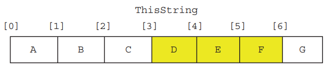

# Built in Functions

## Default

| Description | Pseudocode | Python |
| --- | --- | --- |
| Access a single character using its position P | `ThisString[P]` | `ThisString[P]` |
| Counts from | 1   | 0   |
| Returns the character whose ASCII value is i | `CHR(i : INTEGER)` | `chr(i)` |
| Returns the ASCII value of character ch | `ASC(ch) RETURNS INTEGER` | `ord(ch)` |
| Returns the integer value representing the length of string S | `LENGTH(S : STRING) RETURNS INTEGER` | `len(S)` |
| Returns leftmost L characters from S | `LEFT(S : STRING, L : INTEGER) RETURNS STRING` | `S[0:L]` |
| Returns rightmost L characters from S | `RIGHT(S: STRING, L : INTEGER) RETURNS STRING` | `S[-L:]` |
| Returns a string of length L starting at position P from S | `MID(S : STRING, P : INTEGER, L : INTEGER) RETURNS STRING` | `S[P : P + L]` |
| Returns the character value representing the lower case equivalent of Ch | `LCASE(Ch : CHAR) RETURNS CHAR` | `Ch.lower()` |
| Returns the character value representing the upper case equivalent of Ch | `UCASE(Ch : CHAR) RETURNS CHAR` | `Ch.upper()` |
| Returns a string formed by converting all alphabetic characters of S to upper case | `TO_UPPER(S : STRING) RETURNS STRING` | `S.upper()` |
| Returns a string formed by converting all alphabetic characters of S to lower case | `TO_LOWER(S : STRING) RETURNS STRING` | `S.lower()` |
| Concatenate (join) two strings S1 & S2 | `s = S1 + S2` | `s = S1 + S2` |

## Importables

### Random

#### Pseudocode

```
CHANGE
```

#### Python

```python
# import random module
import random 

# produces a random number between 1 and 6 inclusive.
random.randint(1, 6) 
```

# Slicing in Python



| Description                                 | Python            | Python         |
|---------------------------------------------|-----------------------|----------------|
| If you do not state the upper bound, the slice includes all characters to the end of the string.                               | `ThisString[2:]`      | `CDEFG`        |
| If you do not state the lower bound, the slice includes all characters from the beginning of the string.                               | `ThisString[:2]`      | `AB`           |
| A negative lower bound means that it takes the slice starting from the end of the string.                              | `ThisString[-2:]`     | `FG`           |
| A negative upper bound means that it terminates the string at that position.                              | `ThisString[:-2]`     | `ABCDE`        |

# Type Conversions

## Truncating numbers

- Instead of rounding, sometimes we just want the whole number part of a real number

### Syntax

- #### Pseudocode
	- Returns the integer part of x. 

```
INT(x : REAL) RETURNS INTEGER
```

- #### Python
	- If x is a floating-point number, the conversion truncates towards zero.

```
int(x) 
```

### Example

- #### Python

```python
int("32.64")
# outputs 32
```

## More type Conversions

### Example

- #### Python

```python
# str -> int
int("32.64") # returns 32

# str -> float
float("32.64") # returns 32.64

# int -> float
int(94) # returns 94.0

# float -> int
int(94.5) # returns 94.0
```


